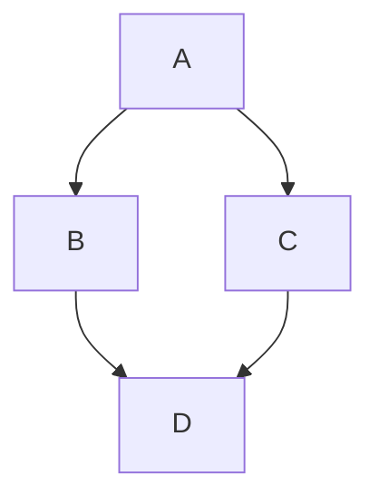

# What is this?

This is an example

```python
def print_hi(name)
  puts "Hi, #{name}"
end
print_hi('Tom')
#=> prints 'Hi, Tom' to STDOUT.
```

$$
\frac{a}{b} = \frac{numerator}{denominator}
$$




