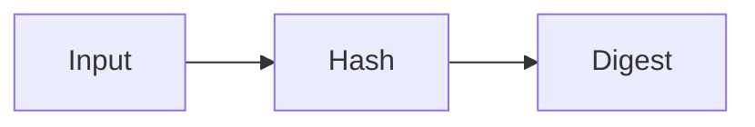
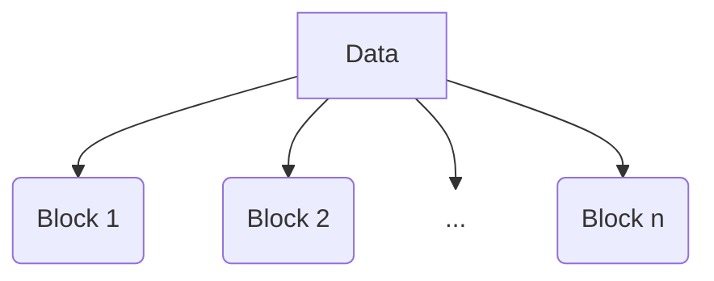
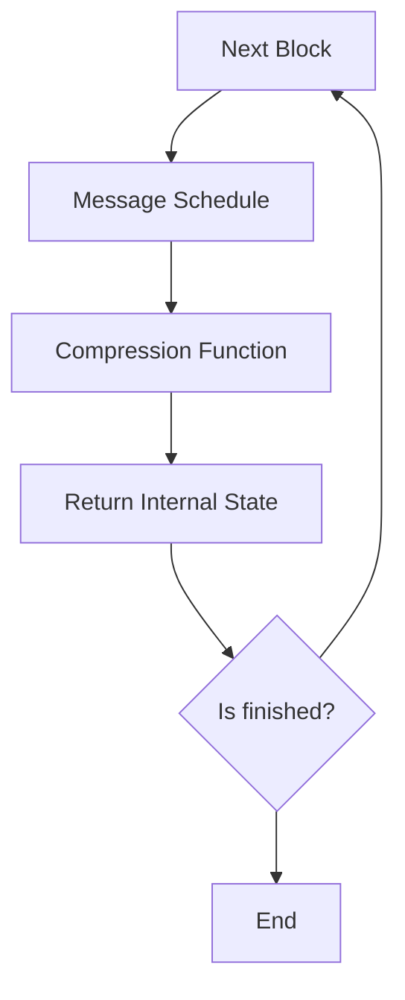

## What is? 
First of all let's see to what `sha256` is used for: it's basically a hash algorithm to ensure the integrity of data, developed by NSA.
It belongs to `Merkle-Damgard` algorithm family.

### Example

```bash
echo -n 'Hello world!' | sha256sum
#c0535e4be2b79ffd93291305436bf889314e4a3faec05ecffcbb7df31ad9e51a
```

or with `openssl`

```bash
echo -n 'Hello world!' | openssl dgst -sha256 
#SHA2-256(stdin)= c0535e4be2b79ffd93291305436bf889314e4a3faec05ecffcbb7df31ad9e51a
```

### What is a hash function?

It's a function that takes and input of every dimension and generate an output, called `digest`, with the most randomic distribution possible.




In the case of `sha256` is a digest of 256bit.


## How it works
### The message
The mechanic is simple:

Let's take a data source, that we'll call `D`, of `m` bytes.

$$ length(D) = mBytes $$

### Blocks

So, we have to split this message in `n` units, that we call `B` (Block). A block is composed by 512bit (64 bytes)

$$ length(B_n) = 64Bytes = 512 bits $$



### Padding

If the message isn't a multiple of 64 bytes (512 bits), we'll pad it and, in case there is no space for additional 9 bytes (1 byte for the termination bit and length in 8 bytes) we'll have n + 1 blocks.

In fact at the end of the original message we'll append a 1 bit - _0x80 for a byte in hexadecimal_ - and we'll fill with zeros until the last 8 bytes,
in which we write, as an integer of 64 bits, the length of the message.

This is an example of "Hello world!" string.
In the first 12 bytes we have the corresponding bytes. 
At the position 13,  we have the bit 1.
At the end, the length expressed in bits (96 in decimal, 0x60 in hex):

#### Message

$$
\left|
\begin{array}{cccccccccccccccc}
\texttt{0x48} & \texttt{0x65} & \texttt{0x6C} & \texttt{0x6C} &
\texttt{0x6F} & \texttt{0x20} & \texttt{0x77} & \texttt{0x6F} &
\texttt{0x72} & \texttt{0x6C} & \texttt{0x64} & \texttt{0x21} 
\end{array}
\right|
$$

#### Padded Block

$$
\left|
\begin{array}{cccccccccccccccc}
\texttt{0x48} & \texttt{0x65} & \texttt{0x6C} & \texttt{0x6C} &
\texttt{0x6F} & \texttt{0x20} & \texttt{0x77} & \texttt{0x6F} &
\texttt{0x72} & \texttt{0x6C} & \texttt{0x64} & \texttt{0x21} &
\texttt{0x80} & \texttt{0x00} & \texttt{0x00} & \texttt{0x00} \\
\texttt{0x00} & \texttt{0x00} & \texttt{0x00} & \texttt{0x00} &
\texttt{0x00} & \texttt{0x00} & \texttt{0x00} & \texttt{0x00} &
\texttt{0x00} & \texttt{0x00} & \texttt{0x00} & \texttt{0x00} &
\texttt{0x00} & \texttt{0x00} & \texttt{0x00} & \texttt{0x00} \\
\texttt{0x00} & \texttt{0x00} & \texttt{0x00} & \texttt{0x00} &
\texttt{0x00} & \texttt{0x00} & \texttt{0x00} & \texttt{0x00} &
\texttt{0x00} & \texttt{0x00} & \texttt{0x00} & \texttt{0x00} &
\texttt{0x00} & \texttt{0x00} & \texttt{0x00} & \texttt{0x00} \\
\texttt{0x00} & \texttt{0x00} & \texttt{0x00} & \texttt{0x00} &
\texttt{0x00} & \texttt{0x00} & \texttt{0x00} & \texttt{0x00} &
\texttt{0x00} & \texttt{0x00} & \texttt{0x00} & \texttt{0x00} &
\texttt{0x00} & \texttt{0x00} & \texttt{0x00} & \texttt{0x60}
\end{array}
\right|
$$

### Constants

In `sha256` there are two kinds of constants used in the algorithm: we call them `H` and `K`.

- H are generated by this formula, for the first 8 primes

$$
    {modf( \sqrt{p} )} * 2^{32}
$$

- K instead, for the first 64 primes

$$
    {modf( \sqrt[3]{p} )} * 2^{32}
$$


### Flow

For every block we'll do this



### Message Schedule

The `Message Schedule` routine is simply a transformation from the input, read as 16 32-bit words, into 64 words.

The first 16 words are the original message. The other ones:

$$
W[i] = W[i-16] + σ0(W[i-15]) + W[i-7] + σ1(W[i-2])
$$

#### σ0

$$
\sigma_0(x) = \mathrm{ROTR}^7(x) \oplus \mathrm{ROTR}^{18}(x) \oplus \mathrm{SHR}^3(x) 
$$

#### σ1

$$
\sigma_1(x) = \mathrm{ROTR}^{17}(x) \oplus \mathrm{ROTR}^{19}(x) \oplus \mathrm{SHR}^{10}(x)
$$

So we'll have 64 words per block.

#### Example of code

```c

static void messageSchedule(uint32_t *dest, uint8_t *src)
{
    memcpy(dest, src, 64); // 64 * 8bit = 512 bit

    for (size_t i = 16; i < 64; i++)
    {
        dest[i] = dest[i - 16] + sigma0(dest[i - 15]) + dest[i - 7] + sigma1(dest[i - 2]);
    }
}
```

### Compression Function - 64 Rounds

First of all we have 8 state variables, that, for the first block, are equal to the constants `H`.

$$
     a = H[0], \\
     b = H[1], \\
     c = H[2], \\
     d = H[3], \\
     e = H[4], \\
     f = H[5], \\
     g = H[6], \\
     h = H[7] 
$$

We'll apply this transformation 64 times, one for each generated word

$$
T1 = h + Σ1(e) + Ch(e,f,g) + K[i] + W[i]
$$
$$
T2 = Σ0(a) + Maj(a,b,c)
$$

$$
h = g, \\
g = f, \\
f = e, \\
e = d + T1, \\
d = c, \\
c = b, \\
b = a, \\
a = T1 + T2
$$

#### Σ0 

$$
\Sigma_0(x) = \mathrm{ROTR}^2(x) \oplus \mathrm{ROTR}^{13}(x) \oplus \mathrm{ROTR}^{22}(x)
$$

#### Σ1 

$$
\Sigma_1(x) = \mathrm{ROTR}^6(x) \oplus \mathrm{ROTR}^{11}(x) \oplus \mathrm{ROTR}^{25}(x)
$$

#### choose

$$
\mathrm{Ch}(e,f,g) = (e \land f) \oplus (\neg e \land g)
$$

#### maj

$$
\mathrm{Maj}(a,b,c) = (a \land b) \oplus (a \land c) \oplus (b \land c)
$$


#### Example of code

```c
static void compressionRounds(uint32_t *H, uint32_t *K, uint32_t *expandedWords)
{
    uint32_t a = H[0];
    uint32_t b = H[1];
    uint32_t c = H[2];
    uint32_t d = H[3];
    uint32_t e = H[4];
    uint32_t f = H[5];
    uint32_t g = H[6];
    uint32_t h = H[7];

    for (size_t i = 0; i < ROUNDS; i++)
    {

        uint32_t T1 = h + Sigma1(e) + choose(e, f, g) + K[i] + expandedWords[i];
        uint32_t T2 = Sigma0(a) + maj(a, b, c);

        h = g;
        g = f;
        f = e;
        e = d + T1;
        d = c;
        c = b;
        b = a;
        a = T1 + T2;
    }

    H[0] += a;
    H[1] += b;
    H[2] += c;
    H[3] += d;
    H[4] += e;
    H[5] += f;
    H[6] += g;
    H[7] += h;
}


```

### Return State

At the end of the 64 rounds we'll update the state variables

$$
H[0] += a, \\
H[1] += b, \\
H[2] += c, \\
H[3] += d, \\
H[4] += e, \\
H[5] += f, \\
H[6] += g, \\
H[7] += h 
$$

If it's the final block this is our digest (obviously converted to a hex string); if not, there'll be the initial state of the next block.
In fact the digest is 256bit long, and we have 8 32-bit words.


### Sources

[https://en.wikipedia.org/wiki/SHA-2]

[https://en.wikipedia.org/wiki/Merkle%E2%80%93Damg%C3%A5rd_construction]

[https://nvlpubs.nist.gov/nistpubs/fips/nist.fips.180-4.pdf]

[https://csrc.nist.gov/projects/cryptographic-algorithm-validation-program/secure-hashing]

[https://www.intel.com/content/www/us/en/developer/articles/technical/intel-sha-extensions.html]
